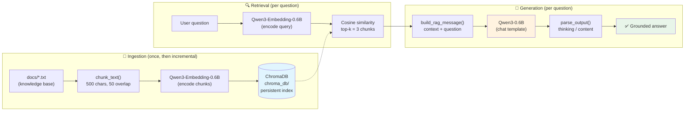
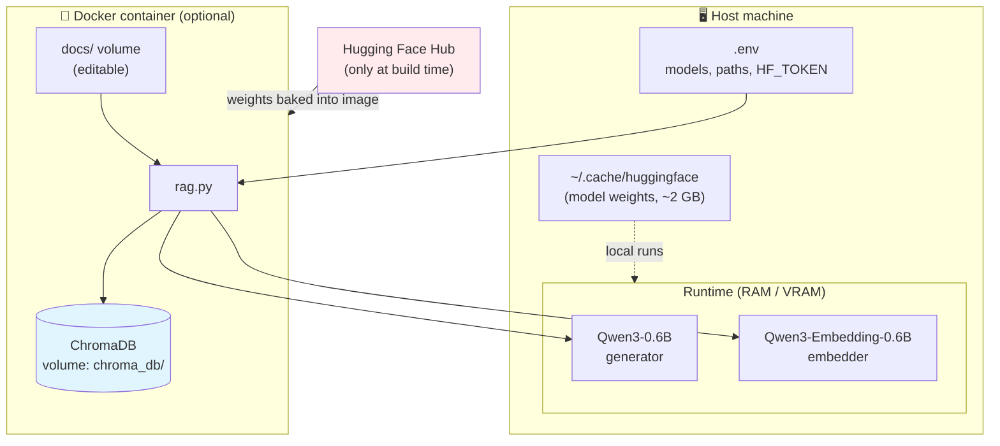
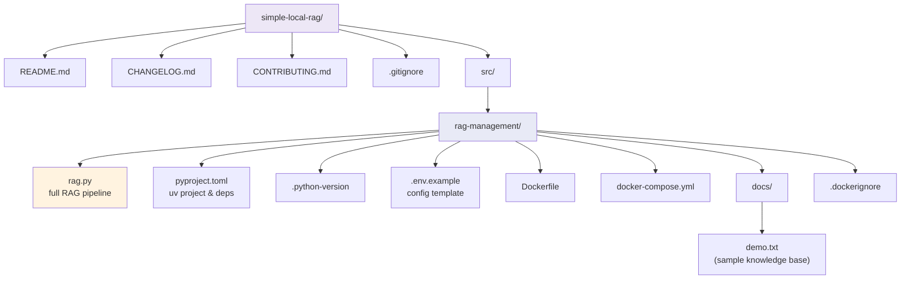

# simple-local-rag

A fully local, offline-capable RAG pipeline built on:

- **Qwen3-0.6B** — generation (chat, thinking-capable)
- **Qwen3-Embedding-0.6B** — retrieval embeddings
- **ChromaDB** — persistent vector store (no external DB server)
- **uv** — fast Python project & dependency management
- **Docker** — self-contained image with both models baked in

## Architecture Overview

### End-to-end RAG flow

From document ingestion to the final answer, everything runs locally:



### Storage & runtime model



Once the image is built (or models cached), the pipeline is **fully offline**:
`HF_HUB_OFFLINE=1` blocks any call to the Hub at runtime.

## Project Structure



All RAG logic (Python, uv config, Docker) lives in `src/rag-management/`.

## Quick start (local, with uv)

```bash
# 1. Install uv (https://docs.astral.sh/uv/)
curl -LsSf https://astral.sh/uv/install.sh | sh

# 2. Configure
cd src/rag-management
cp .env.example .env        # then edit .env (HF_TOKEN only needed for gated models)

# 3. Install dependencies and run (uv creates .venv automatically)
uv sync
uv run rag.py
```

Put your documents as `.txt` files in `src/rag-management/docs/`. The vector
index persists in `src/rag-management/chroma_db/` and only new chunks are
indexed on subsequent runs.

## Docker

```bash
cd src/rag-management
cp .env.example .env
docker compose build          # ~15 min the first time (downloads models into the image)
docker compose up -d
docker compose exec rag uv run rag.py
```

The image sets `HF_HUB_OFFLINE=1` and ships both models, so once built it runs
with no internet access. Test it: `docker compose down`, disconnect the
network, `docker compose up` — it still answers.

For gated models, pass your token at build time without leaking it:

```bash
docker build --secret HF_TOKEN=hf_xxxx .
```

## Configuration

All settings live in `src/rag-management/.env` (see `.env.example`): model
names, paths, `TOP_K`, `CHUNK_SIZE`, `MAX_NEW_TOKENS`, `ENABLE_THINKING`,
and `HF_TOKEN`. Real environment variables override `.env` values.

## Notes

- `ENABLE_THINKING=false` and `MAX_NEW_TOKENS=512` are set for fast grounded
  QA; flip them for reasoning-heavy use cases.
- The pyproject pins CPU torch via uv's `pytorch-cpu` index — swap for a CUDA
  index if you build with a GPU.
- Swap ChromaDB for Qdrant if you later need multi-user serving or heavy
  metadata filtering.

## Contributing

See [CONTRIBUTING.md](CONTRIBUTING.md) — commit format (gitmoji), changelog
rules, PR checklist, and the **AI agents policy** (branches + pull requests
required) apply to all contributions.
