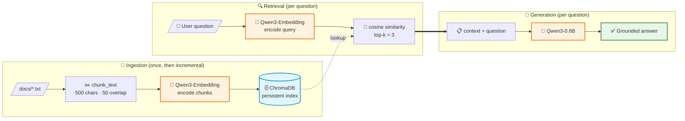
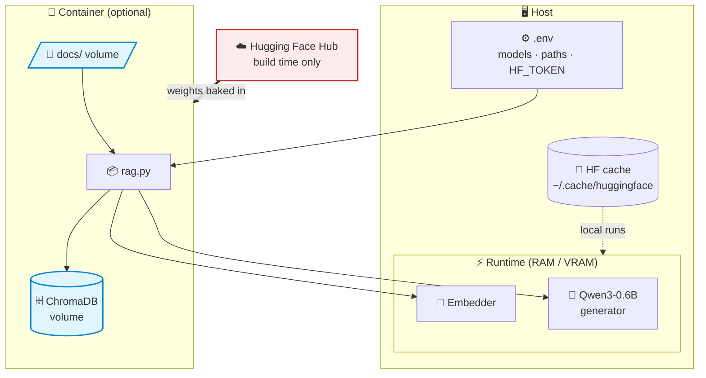
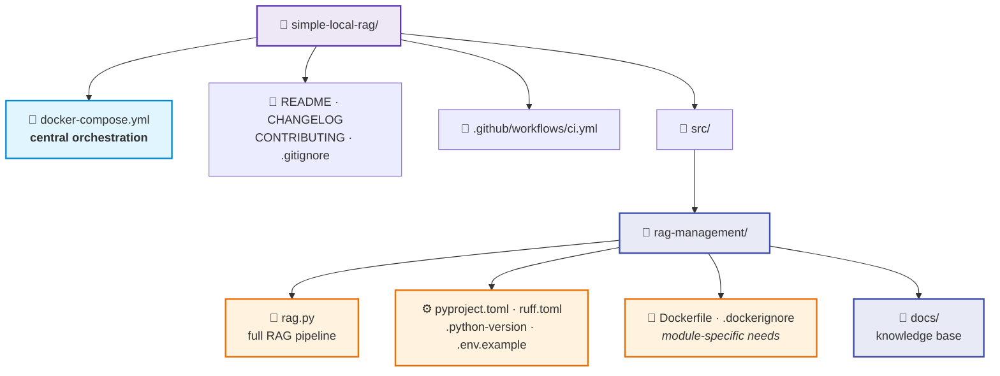

<div align="center">

# 🦙 simple-local-rag

**A fully local, offline-capable RAG pipeline — your data never leaves your machine.**

[](https://www.python.org/)
[](https://docs.astral.sh/uv/)
[](https://www.docker.com/)
[](#)

</div>

---

<table>
<tr>
<td width="50%" valign="top">

### 🧠 Stack

| Layer | Tech |
|---|---|
| Generation | **Qwen3-0.6B** |
| Embeddings | **Qwen3-Embedding-0.6B** |
| Vector store | **ChromaDB** |
| Packaging | **uv** |
| Runtime | **Docker** |

</td>
<td width="50%" valign="top">

### ✨ Highlights

- 🔒 **Fully offline** after first build
- 💾 **Persistent index** — incremental ingestion
- ⚙️ **Config-driven** via `.env`
- 📦 **Self-contained** Docker image
- ♻️ **Simple by design** — no external services

</td>
</tr>
</table>

---

## 🏗️ Architecture

### End-to-end RAG flow

From document ingestion to the final answer, everything runs locally:



### Storage & runtime model



> 🔌 Once built, `HF_HUB_OFFLINE=1` blocks every call to the Hub — the
> pipeline works with the network cable unplugged.

### Project structure



**Design principle:** each module in `src/` owns its `Dockerfile` and config
(specific needs colocated with the business logic), while the root
`docker-compose.yml` orchestrates **all** services in one place — ready to
add more modules later.

All RAG logic (Python, uv config, Docker image) lives in `src/rag-management/`.

---

## 🚀 Getting started

```bash
# 1 — Install uv
curl -LsSf https://astral.sh/uv/install.sh | sh

# 2 — Configure
cd src/rag-management
cp .env.example .env      # HF_TOKEN only needed for gated models

# 3 — Run (uv creates .venv automatically)
uv sync && uv run rag.py
```

Drop your `.txt` files in `src/rag-management/docs/` — the index persists in
`chroma_db/` and only new chunks are indexed on subsequent runs.

### 🐳 Docker (from the repository root)

```bash
cp src/rag-management/.env.example src/rag-management/.env
docker compose build              # ~15 min first time (models baked into the image)
docker compose up -d
docker compose exec rag uv run rag.py
```

The root compose file points each service at its module's build context —
adding a future service (API, UI, another RAG module…) is just a new entry.

> 🔌 The image sets `HF_HUB_OFFLINE=1` and ships both models, so once built it
> runs with no internet access. Test it: `docker compose down`, disconnect
> the network, `docker compose up` — it still answers.

<details>
<summary><b>🔐 Gated models?</b> Pass the token without leaking it</summary>

```bash
docker build --secret HF_TOKEN=hf_xxxx src/rag-management
```
</details>

<details>
<summary><b>⚙️ Configuration reference</b> (all in <code>src/rag-management/.env</code>)</summary>

| Variable | Default | Description |
|---|---|---|
| `HF_TOKEN` | — | HF token (public models: not needed) |
| `HF_HOME` | `~/.cache/huggingface` | HF cache location — absolute path (local runs) |
| `MODEL_NAME` | `Qwen/Qwen3-0.6B` | Generation model |
| `EMBED_NAME` | `Qwen/Qwen3-Embedding-0.6B` | Embedding model |
| `DOCS_DIR` | `docs` | Knowledge base folder |
| `CHROMA_PATH` | `chroma_db` | Persistent index path |
| `TOP_K` | `3` | Chunks retrieved per query |
| `CHUNK_SIZE` / `CHUNK_OVERLAP` | `500` / `50` | Chunking params |
| `MAX_NEW_TOKENS` | `512` | Generation budget |
| `ENABLE_THINKING` | `false` | Qwen3 thinking mode |

Real environment variables override `.env` values.
</details>

---

## 📝 Notes

- `ENABLE_THINKING=false` + `MAX_NEW_TOKENS=512` = fast grounded QA; flip
  both for reasoning-heavy use cases.
- The pyproject pins **CPU torch** via uv's `pytorch-cpu` index — swap for a
  CUDA index when building with a GPU.
- Need multi-user serving or heavy metadata filtering? Swap ChromaDB for
  **Qdrant**.

## 🤝 Contributing

See [CONTRIBUTING.md](CONTRIBUTING.md) — commit format (gitmoji), changelog
rules, PR checklist, and the **AI agents policy** (branches + pull requests
required) apply to all contributions.
